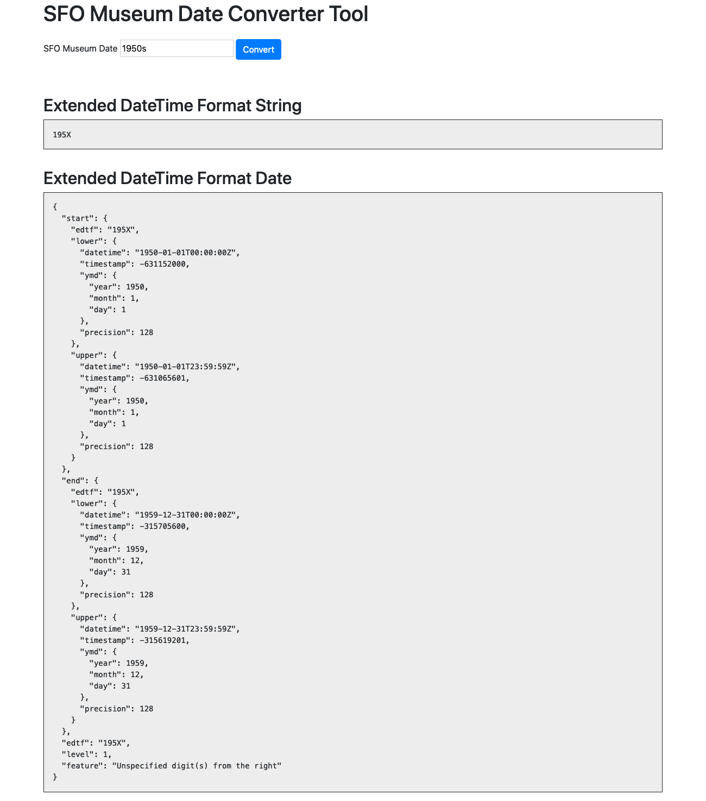

# go-sfomuseum-edtf

Go package for convert SFO Museum date strings in to Extended DateTime Format (EDTF) strings and instances.

## Important

This package is built with SFO Museum-specific uses in mind. While it may expose functionality that is useful to another organization or project that is not its primary goal. It is provided "as-is" in a spirit of sharing and generousity.

If you need to customized or bespoke functionality for working with EDTF strings then you should have a look at the packages that this package builds upon:

* https://github.com/sfomuseum/go-edtf
* https://github.com/sfomuseum/go-edtf-http

## Go 1.16

This branch requires a Go 1.16 (or higher) binary. Go 1.16 is still in active development so you'll need to compile this yourself. You'll probably also want to update the path to the `GO` variable in the Makefile so that the various targets compile against the right version of Go.

## Example

```
package main

import (
	"flag"
	"fmt"
	"github.com/sfomuseum/go-sfomuseum-edtf"
)

func main() {

	flag.Parse()

	for _, sfom_str := range flag.Args() {

		edtf_str, _ := edtf.ToEDTFString(sfom_str)

		fmt.Printf("'%s' becomes '%s'\n", sfom_str, edtf_str)

		edtf_date, _ := edtf.ToEDTFDate(sfom_str)

		lower, _ := edtf_date.Lower()
		upper, _ := edtf_date.Upper()

		fmt.Printf("'%s' spans '%v' to '%v'\n", lower, upper)
	}
}
```

_Error handling removed for the sake of brevity._

## Patterns

The following date patterns, used by SFO Museum, are supported by this package.

### Month/Year

| SFO Museum string | EDTF string |
| --- | --- |
| 04/1972 | 1972-04 |
| c. 3/1984 | 1984-03~ |

### Month/Day/Year

| SFO Museum string | EDTF string |
| --- | --- |
| 6/30/2010 | 2010-06-30 |
| c. 02/29/2020 | 2020-02-29~ |

### Early (year)

| SFO Museum string | EDTF string |
| --- | --- |
| early 1970s | 1970-01/1970-04 |
| c. early 1950s | 1950-~01/1950-~04 |
| Early 1960s | 1960-01/1960-04 |

### Mid (year)

| SFO Museum string | EDTF string |
| --- | --- |
| mid 1970s | 1970-05/1970-08 |
| c. mid 1950s | 1950-~05/1950-~08 |
| Mid 1960s | 1960-05/1960-08 |

### Late (year)

| SFO Museum string | EDTF string |
| --- | --- |
| late 1970s | 1970-09/1970-12 |
| c. late 1950s | 1950-~09/1950-~12 |
| Late 1960s | 1960-09/1960-12 |

### Decade

| SFO Museum string | EDTF string |
| --- | --- |
| 1930s | 193X |
| c 1980s | ~198X-01-01/~198X-12-31 |

### Range

| SFO Museum string | EDTF string |
| --- | --- |
| 1970 - 1980 |   1970/1980 |
| 1980-1990 |     1980/1990 |
| c. 1994 -2010 | ~1994/~2010 |
| c. 2018- 2020 | ~2018/~2020 |

### YYYY

| SFO Museum string | EDTF string |
| --- | --- |
| 1900 |    1900 |
| c. 1843 | 1843~ |

### Month/Day/Year (long-form)

| SFO Museum string | EDTF string |
| --- | --- |
| Mar 03 1960 | 1960-03-03 |
| Jul 4, 1979 | 1979-07-04 |

## Tools

To build binary versions of these tools run the `cli` Makefile target. For example:

```
$> make cli
go build -mod vendor -o bin/to-edtf cmd/to-edtf/main.go
go build -mod vendor -o bin/to-edtf-string cmd/to-edtf-string/main.go
```

### server

HTTP server for exposing EDTF-related API methods.

```
> ./bin/server -h
HTTP server for exposing EDTF-related API methods.
Usage:
	 ./bin/server [options]
  -bootstrap-prefix string
    	A relative path to append to all Bootstrap-related paths the server will listen for requests on.
  -enable-edtf-date-api
    	Enable the SFO Museum to-edtf-date API endpoint (default true)
  -enable-edtf-string-api
    	Enable the SFO Museum to-edtf-string API endpoint (default true)
  -enable-matches-api
    	Enable the EDTF matches API endpoint (default true)
  -enable-parse-api
    	Enable the EDTF parse API endpoint (default true)
  -enable-valid-api
    	Enable the EDTF valid API endpoint (default true)
  -enable-www
    	Enable the user-facing web application. (default true)
  -path-edtf-date-api string
    	The path to listen for requests to the SFO Museum to-edtf-date API on. (default "/api/sfomuseum/to-edtf-date")
  -path-edtf-string-api string
    	The path to listen for requests to the SFO Museum to-edtf-string API on. (default "/api/sfomuseum/to-edtf-string")
  -path-matches-api string
    	The path to listen for requests to the EDTF matches API on. (default "/api/edtf/matches")
  -path-parse-api string
    	The path to listen for requests to the EDTF parse API on. (default "/api/edtf/parse")
  -path-static string
    	The path to listen for requests to the user-facing web application on. (default "/static")
  -path-valid-api string
    	The path to listen for requests to the EDTF valid API on. (default "/api/edtf/valid")
  -path-www string
    	The path to listen for requests to the user-facing web application on. (default "/")
  -server-uri string
    	A valid aaronland/go-http-server URI. (default "http://localhost:8080")
```

For example:

```
$> ./bin/server 
2021/01/11 14:00:13 Listening on http://localhost:8080
```

And then if you visit `http://localhost:8080` in your web browser you would see a simple web application like this:



You can also invoke the individual API endpoints from the command line. For example:

```
$> curl -s 'http://localhost:8080/api/sfomuseum/to-edtf-date?date=1950s' | jq
{
  "start": {
    "edtf": "195X",
    "lower": {
      "datetime": "1950-01-01T00:00:00Z",
      "timestamp": -631152000,
      "ymd": {
        "year": 1950,
        "month": 1,
        "day": 1
      },
      "precision": 128
    },
    "upper": {
      "datetime": "1950-01-01T23:59:59Z",
      "timestamp": -631065601,
      "ymd": {
        "year": 1950,
        "month": 1,
        "day": 1
      },
      "precision": 128
    }
  },
  "end": {
    "edtf": "195X",
    "lower": {
      "datetime": "1959-12-31T00:00:00Z",
      "timestamp": -315705600,
      "ymd": {
        "year": 1959,
        "month": 12,
        "day": 31
      },
      "precision": 128
    },
    "upper": {
      "datetime": "1959-12-31T23:59:59Z",
      "timestamp": -315619201,
      "ymd": {
        "year": 1959,
        "month": 12,
        "day": 31
      },
      "precision": 128
    }
  },
  "edtf": "195X",
  "level": 1,
  "feature": "Unspecified digit(s) from the right"
}
```

#### Notes

* Although it is possible to assign custom paths for API endpoints it is not yet possible to relay that information down to the Javascript files that invoke those endpoints. To that end custom API paths shouldn't be considered ready to use at this time.

#### AWS

These notes are for running the `server` in AWS using the Lambda -> API Gateway -> CloudFront pattern.

##### Lambda

_This documentation is incomplete._

```
$> make lambda-server
if test -f main; then rm -f main; fi
if test -f server.zip; then rm -f server.zip; fi
GOOS=linux ~/src/go/bin/go build -mod vendor -o main cmd/server/main.go
zip server.zip main
  adding: main (deflated 45%)
rm -f main
```

###### Environment Variables

| Name | Value | Notes |
| --- | --- | --- |
| EDTF_SERVER_URI | `lambda://` | |

##### API Gateway

_This documentation is incomplete._

###### (Lambda) Environment Variables

If you are running the `server` tool as a Lambda function behind an API Gateway endpoint you'll need to set the following environment variables in your Lambda function:

| Name | Value | Notes |
| --- | --- | --- |
| EDTF_BOOTSTRAP_PREFIX | {API_GATEWAY_DEPLOYMENT_STAGE} | For example if the deployment stage is "edtf" the value of this environment variable would be "/edtf" |

##### CloudFront

_This documentation is incomplete._

### to-edtf

Parse one or more SFO Museum date strings and return a list of JSON-encode edtf.EDTFDate objects.

```
> ./bin/to-edtf -h
Parse one or more SFO Museum date strings and return a list of JSON-encode edtf.EDTFDate objects.
Usage:
	 ./bin/to-edtf date(N) date(N)
```

For example:

```
$> ./bin/to-edtf 04/1972 'early 1970s'
[
  {
    "start": {
      "edtf": "1972-04",
      "lower": {
        "datetime": "1972-04-01T00:00:00Z",
        "timestamp": 70934400,
        "ymd": {
          "year": 1972,
          "month": 4,
          "day": 1
        },
        "precision": 64
      },
      "upper": {
        "datetime": "1972-04-01T23:59:59Z",
        "timestamp": 71020799,
        "ymd": {
          "year": 1972,
          "month": 4,
          "day": 1
        },
        "precision": 64
      }
    },
    "end": {
      "edtf": "1972-04",
      "lower": {
        "datetime": "1972-04-30T00:00:00Z",
        "timestamp": 73440000,
        "ymd": {
          "year": 1972,
          "month": 4,
          "day": 30
        },
        "precision": 64
      },
      "upper": {
        "datetime": "1972-04-30T23:59:59Z",
        "timestamp": 73526399,
        "ymd": {
          "year": 1972,
          "month": 4,
          "day": 30
        },
        "precision": 64
      }
    },
    "edtf": "1972-04",
    "level": 0,
    "feature": "Date"
  },
  {
    "start": {
      "edtf": "1970-01",
      "lower": {
        "datetime": "1970-01-01T00:00:00Z",
        "timestamp": 0,
        "ymd": {
          "year": 1970,
          "month": 1,
          "day": 1
        },
        "precision": 64
      },
      "upper": {
        "datetime": "1970-01-31T23:59:59Z",
        "timestamp": 2678399,
        "ymd": {
          "year": 1970,
          "month": 1,
          "day": 31
        },
        "precision": 64
      }
    },
    "end": {
      "edtf": "1970-04",
      "lower": {
        "datetime": "1970-04-01T00:00:00Z",
        "timestamp": 7776000,
        "ymd": {
          "year": 1970,
          "month": 4,
          "day": 1
        },
        "precision": 64
      },
      "upper": {
        "datetime": "1970-04-30T23:59:59Z",
        "timestamp": 10367999,
        "ymd": {
          "year": 1970,
          "month": 4,
          "day": 30
        },
        "precision": 64
      }
    },
    "edtf": "1970-01/1970-04",
    "level": 0,
    "feature": "Time Interval"
  }
]
```

### to-edtf-string

Parse one or more SFO Museum date strings and return a line-separated list of valid EDTF strings.

```
> ./bin/to-edtf-string -h
Parse one or more SFO Museum date strings and return a line-separated list of valid EDTF strings.
Usage:
	 ./bin/to-edtf-string date(N) date(N)
```

For example:

```
$> ./bin/to-edtf-string 04/1972 'early 1970s'
1972-04
1970-01/1970-04
```

## See also

* https://github.com/sfomuseum/go-edtf
* https://github.com/aaronland/go-http-server